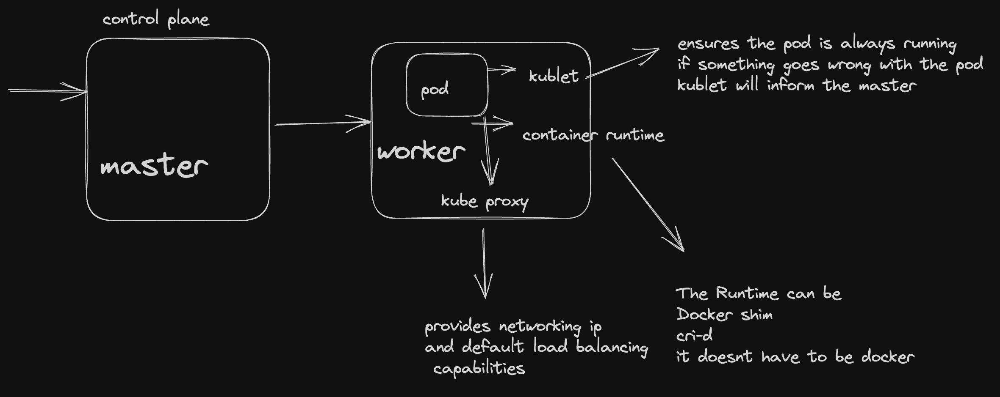
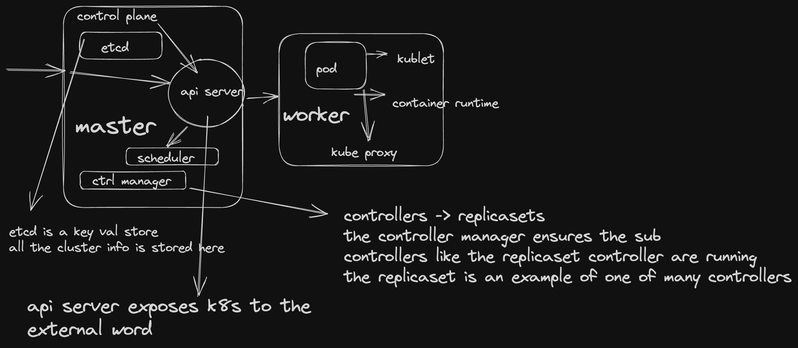

## Architecture

- Kubernetes has a Control Plane and a Data Plane

### Control Plane Components, found on master nodes

We can have multiple master nodes in a cluster

- API server
- etcd
- scheduler
- controller manager
- clout controller manager

### Data Plane Components, found on worker nodes

- Kubelet
- Kube Proxy
- Controller Runtime

#### in order to understand the architecture

#### the main components of the worker are

- Kube proxy, networking, and default load balancing
- kublet, signals to master if pod has failed
- container run time, ie docker shim

### main components of the master are

- api server, interaction with outside world
- [scheduler](https://kubernetes.io/docs/concepts/scheduling-eviction/kube-scheduler/), spins up new nodes? A scheduler watches for newly created Pods that have no Node assigned. For every Pod that the scheduler discovers, the scheduler becomes responsible for finding the best Node for that Pod to run on. The scheduler reaches this placement decision taking into account the scheduling principles described below.
- control manager, makes sure controllers are running such as replicaset
- etcd , key val store
- cloud control manager, will create load balancer on aws or azure etc, it translates requests to cloud services, if running on premise we do not need a CCM
