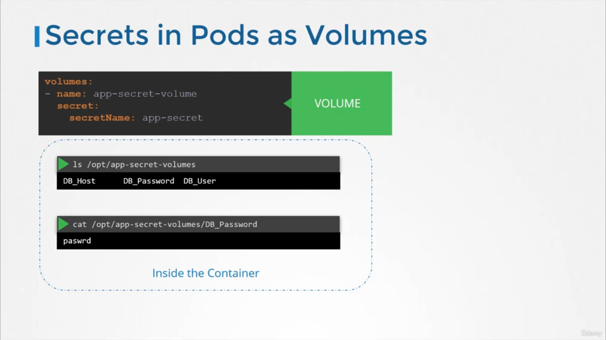

## secrets

#### There are 2 steps to create secrets

1. create the secret
2. inject into the pod

- you can create either imperatively or declaritvely

```
    kubectl create secret generic [secret name] --from-literal=DB_HOST=mysql
```

- if you want multi keys repeat the --from-literal

### or you can create from a file

```
    kubectl create secret generic [secret name] --from-file=[path]
```

### check the .yaml for a declaritive example

```
    kubectl create -f secret.yaml
```

### to get secrets

```
    kubectl get secrets
```

- to get expanded details

```
    kubectl describe secrets
```

- to view the secrets not in a hidden way

```
    kubectl get secret app-secret -o yaml
```

### to inject into a pod

- under spec:containers:envFrom:-secretRef:name:app-secret

### you can also inject as a volume into a pod



## additional notes on secrets

- secrets are not encoded
- do not check into github lol
- data isnt encrypted in etcd by default
